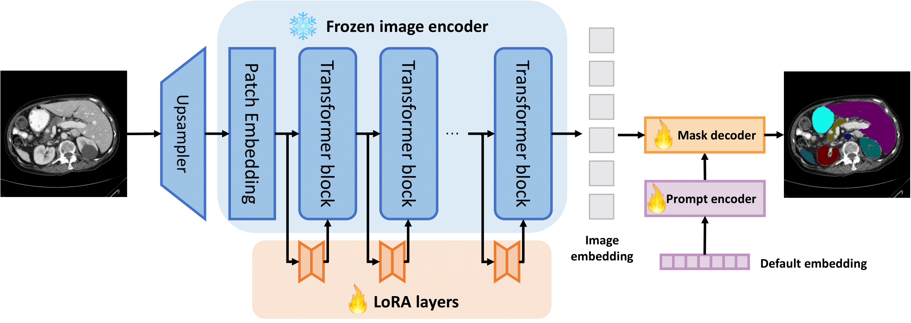

<h1 align="center">
RAG-SAM: A Hybrid Framework for Medical Image Segmentation Using Retrieval-Augmented Generation and Segment Anything Model
</h1>
<p align="center">
    Project of AI3604 Computer Vision, 2024 Fall, SJTU
    <br />
    <a href="https://github.com/zzctmd"><strong>Zichen Zou</strong></a>
    &nbsp;
    <a href="https://github.com/ccmoony"><strong>Yuanjie Chen</strong></a>
    &nbsp;
    <a href="https://github.com/why618188"><strong>Huayi Wang</strong></a>
    &nbsp;
    <a href="https://github.com/Yog24"><strong>Gao Yuan</strong></a>
    <br />
</p>

## Abstract
  
Medical image segmentation is essential for diagnosis and treatment planning but faces challenges due to limited annotated data and domain-specific requirements. To address these issues, we explore parameter-efficient fine-tuning techniques, Low-Rank Adaptation(LoRA) and Adapter tuning, to adapt the Segment Anything Model (SAM) for medical imaging tasks with minimal parameter updates. We conduct experiments on the BTCV and FLARE22 datasets, demonstrating the effectiveness of these methods in improving segmentation accuracy while maintaining computational efficiency. To leverage few-shot capability of SAM, we integrate the Retrieval-Augmented Generation(RAG) framework. Our work provides an efficient approach to adapt foundation models like SAM for medical image segmentation, achieving state-of-the-art performance with significantly reduced computational overhead.


## 🛠️ Requirements
To run **SAMed**, please run the following commands:
```
conda create -n SAMed python=3.7.11
conda activate SAMed
pip install -r requirements.txt 
```

To run **Medical-SAM-Adapter**, please run the following commands:
```
cd Medical-SAM-Adapter
conda env create -f environment.yml
conda activate sam_adapt
```

Download parameters of the original model SAM from [交大云盘](https://jbox.sjtu.edu.cn/l/q1hgrW) and put it into the `SAMed\checkpoints` folder

## 🚀 Training
We use two RTX 3090 GPUs for training.

### Dataset Preparation

Please Download the Synapse_origin dataset and FlARE_origin dataset which are trained and tested in our project from [交大云盘](https://jbox.sjtu.edu.cn/l/q1hgrW) and put them into the `dataset` folder.Then you need to run the code in `./SAMed/preprocess` to make the 3D data to slices for training and testing.The detailed operation can be found in the README file of this folder.After that  the directory structure of `dataset`is as follows:
```
dataset
├── FLARE
│   ├── testset
│   └── trainset
├── FLARE_origin
│   ├── images
│   └── labels
├── Synapse_12
│   ├── test_vol_h5
│   └── train_npz
└── Synapse_origin
```
### SAMed

1. Navigate to the `SAMed` directory:
```
cd SAMed
```

2. Run the following commands to start training:

> For FLARE dataset training
```bash
python train_FLARE.py --root_path <Your folder> --output <Your output path> --warmup --AdamW 
```

> For Synapse dataset training
```bash
python train.py --root_path <Your folder> --output <Your output path> --warmup --AdamW 
```

Check the results in `<Your output path>`.

### Medical-SAM-Adapter

1. Navigate to the `Medical-SAM-Adapter` directory:
```
cd Medical-SAM-Adapter
```

2. Run the following command to start training:

> For Synapse dataset training

```bash
python train.py -net sam -mod sam_adpt -exp_name REFUGE-MSAdapt -sam_ckpt ./checkpoint/sam/sam_vit_b_01ec64.pth -image_size 1024 -b 32 -dataset REFUGE -data_path ./data/REFUGE-MultiRater
```

- You can change the exp_name to any name you prefer.
- If you encounter memory issues, you may reduce the `image_size` or `batch size`.

## 💡 Inference
Here are the instructions: 

1. Please download the [LoRA checkpoint of SAMed](https://jbox.sjtu.edu.cn/l/q1hgrW) in the output folder with differnet versions or train the model yourself, and put them in the `output` folder.

2. Ensure that you have already preprocessed the dataset.

3. Run following commands to evaluate the performance of **SAMed**:

> For FLARE dataset testing
```bash
python test.py --volume_path <Your testset> --num_classes 8 --list_dir <Your listdir> --is_savenii --output_dir <Your output directory> --lora_ckpt <Your pretrained model> 
```

> For Synapse dataset testing
```bash
python test.py --volume_path <Your testset> --num_classes 12 --list_dir <Your listdir> --is_savenii --output_dir <Your output directory> --lora_ckpt <Your pretrained model> 
```

You also need to change some code in the `test.py` for different dataset testing,you can learn the detail in the code.

4. Run following commands to evaluate the performance of **Medical-SAM-Adapter**:

> For Synapse dataset training

```bash
python val.py -net sam -mod sam_adpt -exp_name REFUGE-MSAdapt -sam_ckpt ./checkpoint/sam/sam_vit_b_01ec64.pth -image_size 1024 -b 32 -dataset REFUGE -data_path ./data/REFUGE-MultiRater
```

## 📖 Retrieval Augumented Generation
>For FLARE dataset testing
```bash
python test_rag.py --volume_path <Your testset> --num_classes 8 --list_dir <Your listdir> --is_savenii --output_dir <Your output directory> --lora_ckpt <Your pretrained model>
```

>For Synapse dataset testing
```bash
python test_rag.py --volume_path <Your testset> --num_classes 12 --list_dir <Your listdir> --is_savenii --output_dir <Your output directory> --lora_ckpt <Your pretrained model> 
```

You also need to change some code in the test_rag.py for different dataset testing,you can learn the detail in the code.

## Contact
If you have any questions, please contact us via 
- cyj2003@sjtu.edu.cn
- zzcnb123456@sjtu.edu.cn

## Acknowledgement
We appreciate the developers of [Segment Anything Model](https://github.com/facebookresearch/segment-anything) and the provider of the [Synapse multi-organ segmentation dataset](https://www.synapse.org/#!Synapse:syn3193805/wiki/217789). The code of our project is built upon [SAMed](https://github.com/hitachinsk/SAMed) and [SAM-Adapter](https://github.com/tianrun-chen/SAM-Adapter-PyTorch), and we express our gratitude to these awesome projects.


